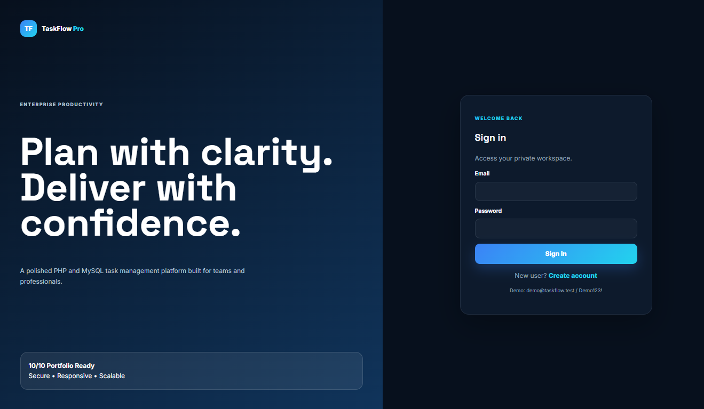
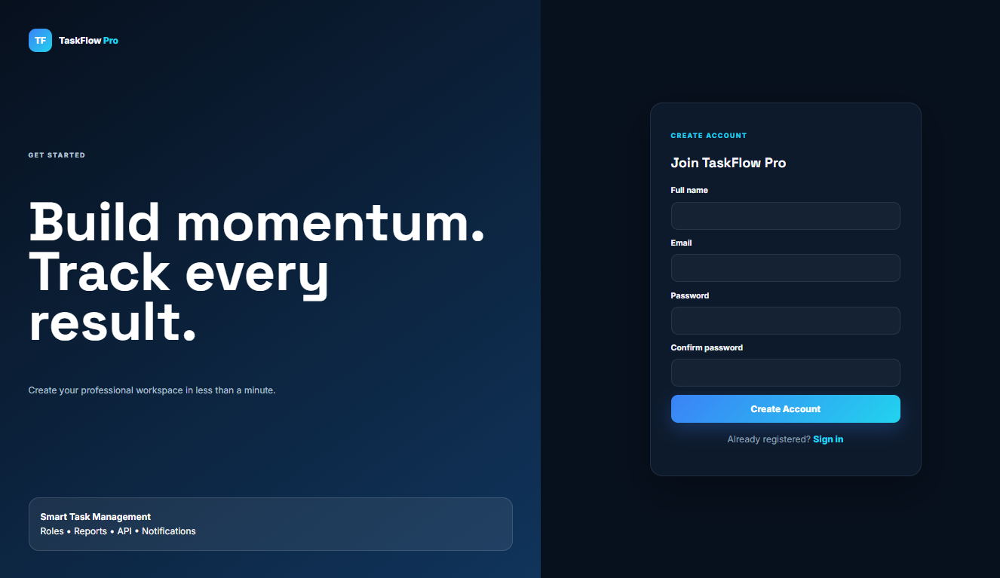
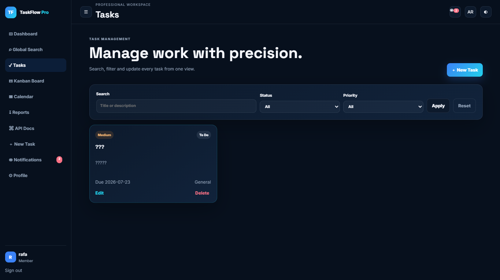
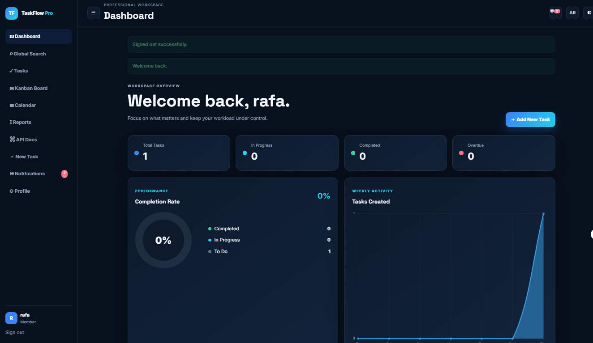
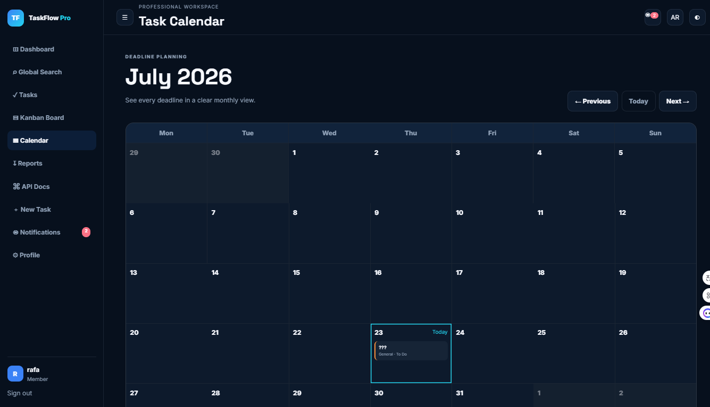
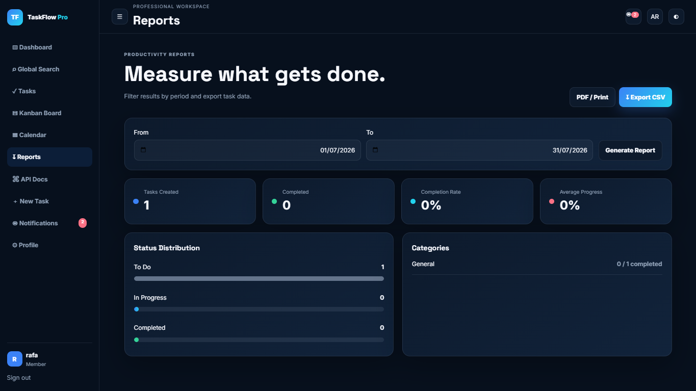
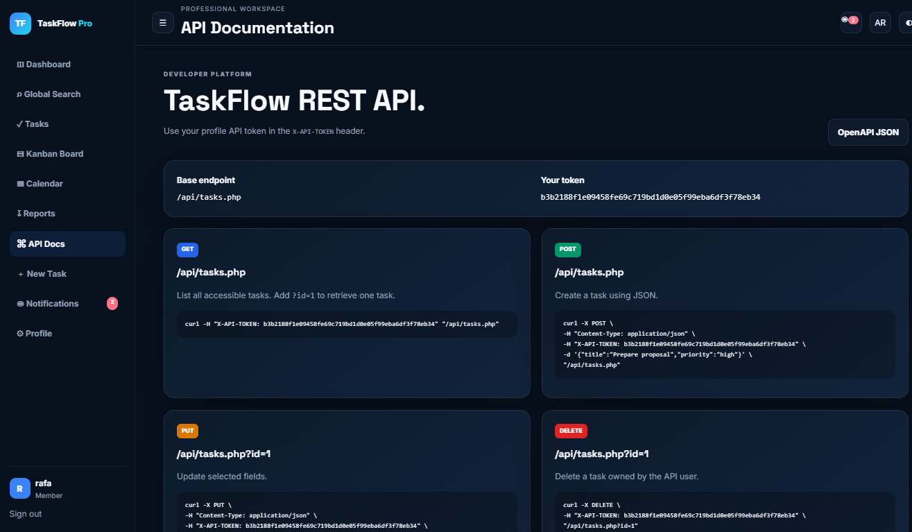
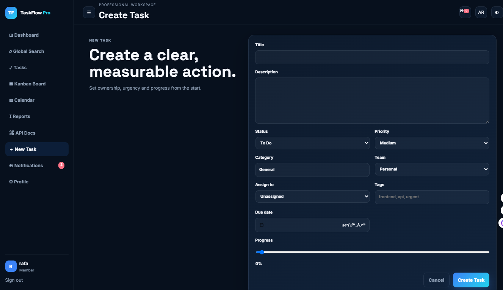
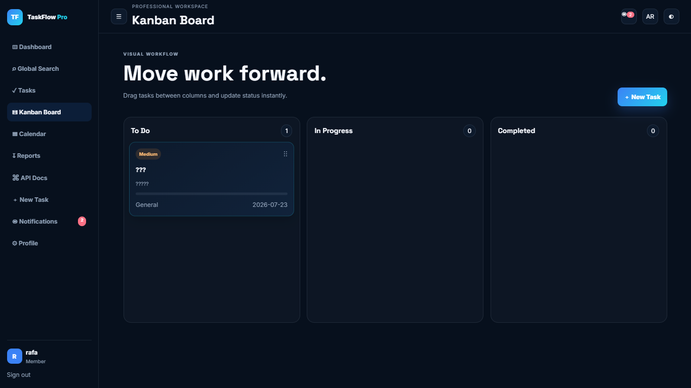
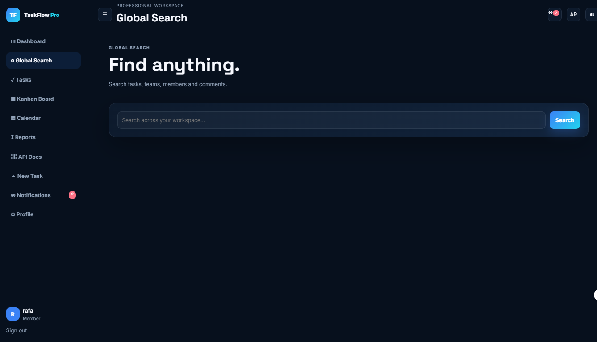

# 🚀 TaskFlow Pro

A modern **Task & Project Management System** built with **PHP, MySQL, JavaScript, Bootstrap**, featuring Kanban boards, Calendar scheduling, Reports, Notifications, Global Search, and REST API support.

🌐 **Live Demo:** https://taskflowpro.fwh.is

---

## ✨ Features

- 🔐 User Authentication
- 📋 Task Management
- 📌 Kanban Board
- 📅 Calendar View
- 📊 Reports & Analytics
- 🔍 Global Search
- 🔔 Notifications
- 🌍 Multi-language Support
- 📡 REST API
- 📱 Responsive Design

## ✨ Features

- 🔐 User Authentication
- 📊 Dashboard with Statistics
- ✅ Task Management (Create, Edit, Delete)
- 📁 Project Management
- 📅 Calendar View
- 📌 Kanban Board
- 👥 User Management
- 🎯 Task Priorities
- 📈 Progress Tracking
- 📱 Responsive Design
- ⚡ Fast Performance

---

## 🛠 Technology Stack

- PHP 8
- MySQL
- JavaScript (ES6)
- Bootstrap 5
- HTML5
- CSS3
- PDO
- FullCalendar

---

## 📷 Screenshots


### Login


---

### Register


---

### Dashboard


---

### Global Search


---

### Tasks


---

### Kanban Board


---

### Calendar


---

### Create Task


---

### Reports


---

### API Documentation

## ⚙ Installation

```bash
git clone https://github.com/rafallhe/taskflow-pro.git
```

Import the SQL database.

Update your database credentials inside:

```
config/database.php
```

Run the project using Apache and PHP.

---

## 📂 Project Structure

```
assets/
config/
includes/
auth/
uploads/
database/
```

---

## 👨‍💻 Author

**Rafallhe**

GitHub:
https://github.com/rafallhe

---

## 📄 License

This project is for educational and portfolio purposes.
